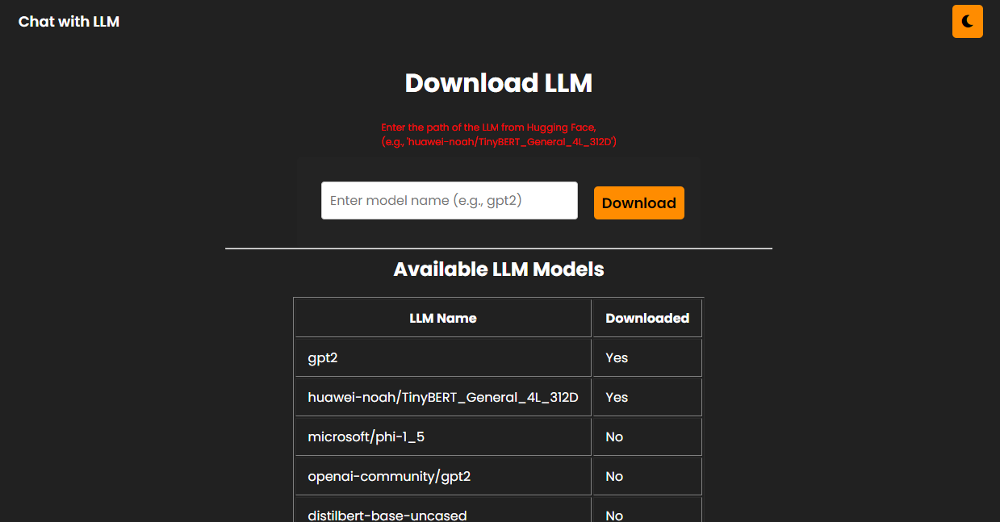
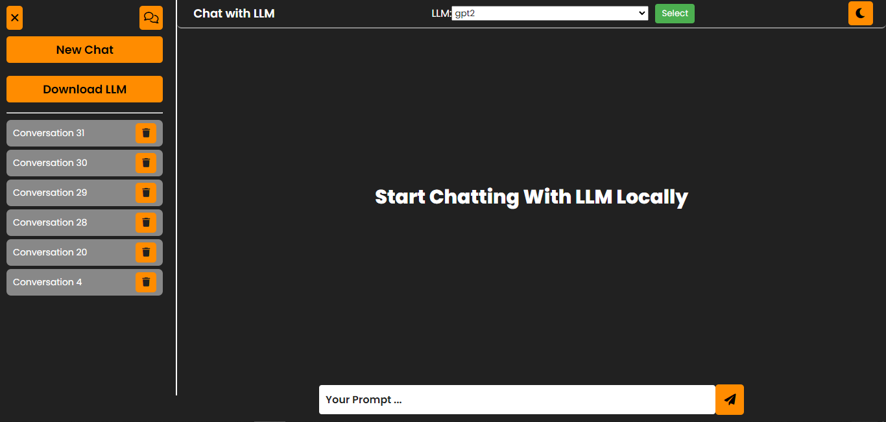
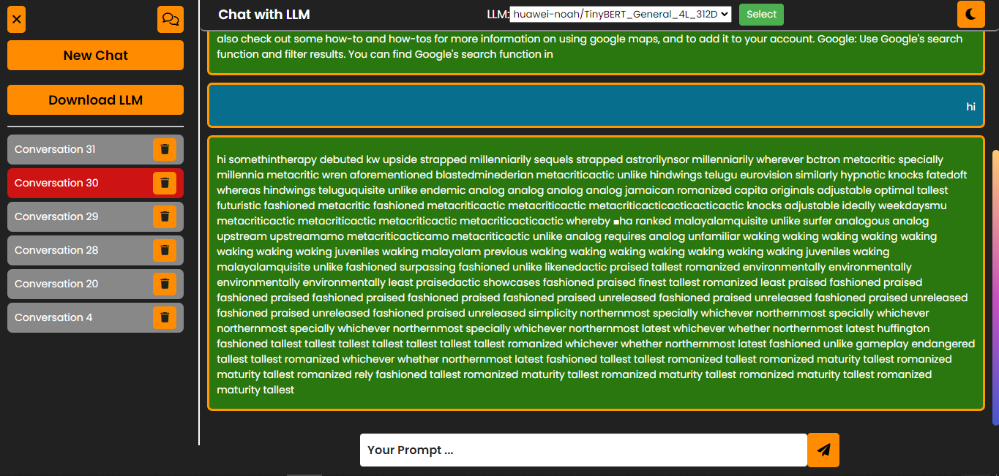
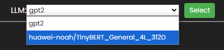

# Chat with LLM Locally

A Django-based application that enables local interaction with language models (LLMs) like GPT-2. The app allows users to initiate conversations, interact with locally downloaded LLMs, and manage conversations efficiently. This project serves as a foundation for experimenting with natural language processing models in a user-friendly interface.

## Features

- **Interactive Chat Interface**: Users can chat with an LLM in real-time.
- **Model Selection**: Support for multiple locally downloaded models, with the ability to switch between them dynamically.
- **Conversation Management**: Start new conversations, view previous chats, and delete existing ones.
- **Model Management**: Download and manage models from Hugging Face directly within the app.
- **Error Handling**: User-friendly error messages for issues like missing models or corrupted downloads.

## Requirements

- Python 3.8 or above
- Django 4.2+
- Transformers library by Hugging Face
- Hugging Face Hub authentication token

## Installation

1. Clone the repository:
   ```bash
   git clone https://github.com/drisskhattabi6/Chat-with-LLM-Locally.git
   cd Chat-with-LLM-Locally
   ```

2. Install dependencies:
   ```bash
   pip install -r requirements.txt
   ```

3. Set up the database:
   ```bash
   python manage.py migrate
   ```

4. Create a superuser for admin access (Optional):
   ```bash
   python manage.py createsuperuser
   ```

5. Start the development server:
   ```bash
   python manage.py runserver
   ```

6. Access the application at `http://127.0.0.1:8000`.

## Configuration

- Add your Hugging Face authentication token in the `login()` function in `views.py`:
   ```python
   login(token="your_huggingface_token")
   ```

## Usage

1. **Download a Model**:
   - Go to the "Download LLM" page and provide the name of the model (e.g., `gpt2`) to download.
   

2. **Start a Conversation**:
   - Click "New Conversation" to initiate a chat.
   

3. **Chat**:
   - Enter your messages and receive responses from the selected LLM.
   

4. **Switch Models**:
   - Choose a different model from the dropdown menu.
   

5. **Delete Conversations**:
   - Delete old conversations to keep the interface clean.

## Future Additions


1. **Support for Additional Model Architectures**: 
   - Extend compatibility to include models like T5, BERT, or custom fine-tuned models.

2. **User Authentication**:
   - Enable user-specific conversation history and settings.

3. **Conversation Export**:
   - Add functionality to export conversations as JSON, CSV, or text files.

4. **UI Enhancements**:
   - Improve the user interface with better responsiveness and real-time interaction.

5. **Model Performance Insights**:
   - Display metrics such as inference time and memory usage for each model.


## Collaboration

We welcome contributions to this project! If you have ideas or enhancements, feel free to submit an issue or a pull request. 

To contribute:

1. Fork the repository.
2. Create a new branch for your feature:
   ```bash
   git checkout -b feature/your-feature-name
   ```
3. Commit your changes:
   ```bash
   git commit -m "Add your feature description"
   ```
4. Push to your branch:
   ```bash
   git push origin feature/your-feature-name
   ```
5. Open a pull request on GitHub.

Thank you for helping make **Chat with LLM Locally** better for everyone!

## License

This project is licensed under the MIT License. See the [LICENSE](LICENSE) file for details.
